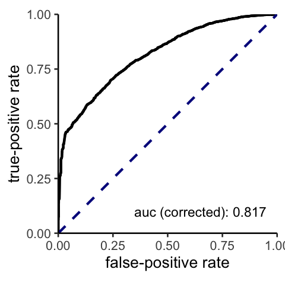

positive-unlabeled learning for dms datasets (pudms)
================

# Description

This package offers a streamlined analysis via PUlasso algorithm for
learning sequence-function relationships using deep mutational scanning
data sets.

## Installation

Install using **devtools** package:

``` r
# install.packages("devtools")
devtools::install_github("RomeroLab/pudms")
```

## Input files

1.  Two protein sequence text files, one for the labeled (sorted) and
    the other for the unlabeled (unsorted).
    
      - Text files with one sequence per line
      - (Optional) Can be gzip compressed.
      - Example
    
    <!-- end list -->
    
    ``` console
    MYYKEIAHALFSDLFALSELYIAVRY*
    MYYKEIAHALFSALFALSPLYIAVRM*
    MYYKELAHALFSAHFALSELYIAVRY*
    MYYKEIAHALFSALFAEHELYIAVRY*
    MRYKEIAHALFSALFALPELYIAVRY*
    ...
    ```

2.  The prevalence of the positive sequences in the unlabeled set (py1).
    If unknown, `pudms` package searches over a grid of py1 values and
    picks the best one based on the predictive performance on the test
    set.

-----

# Examples

## Model fitting with a full data set and a py1 value

Here we demonstrate basic usage of the package using sample labeled and
unlabeled sequences.

**Inputs:**

  - path\_l and path\_u (file paths (in strings) for the labeled and
    unlabeled sets)
  - py1

Here we use the paths (path\_l and path\_u) where the sample text files
are saved in the package. Please replace them with the actual file paths
(e.g. `path_l = your dir/filename.txt"`).

``` r
library(pudms)
# paths for the example txt.gz files
path_l = "inst/extdata/Rocker_sel_sequences_filtered.txt.gz"
path_u = "inst/extdata/Rocker_ref_sequences_filtered.txt.gz"

# py1 
protein_py1 = 0.002 # change this to the prevalence of positive examples in your unlabeled set
```

  - `Rocker_sel_sequences_filtered.txt.gz` contains 703030 sequences of
    length 27.
  - `Rocker_ref_sequences_filtered.txt.gz` contains 1287155 sequences of
    length 27.

**1. We generate a protein dataset from the txtfiles with specified
paths:**

``` r
rocker = create_protein_dat(path_l = path_l, path_u = path_u) 
# will not run unless path_l and path_u are correctly specified with local paths for those files
```

> This dataset is also contained in `pudms` package, and can be loaded
> via:
> 
> ``` r
> data("rocker")
> ```
> 
> The help page for this dataset is available via `help("rocker")`.

**2. Now, we fit a model:**

``` r
fit1 = pudms(protein_dat = rocker, py1 = protein_py1) 
#>  1. create model frames from an aggregated dataset:
#> create a sequence matrix
#> check number of unique factors in each position
#> obtain ``reference`` amino-acid states
#> convert to the sparse one-hot-encoding model matrix
#> check whether a filtered X is a full rank matrix
#> filtered X is a full rank matrix
#> 
#> 
#>  2. fit a model
#> Fitting 0th lambda
#> converged at 24th iterations
#> 
#> 
#>  3. compute p-values
```

(pudms is a wrapper function which sequentially calls
`create_model_frame`,`filter_mut_less_than_thresh`, `grpPUlasso`, and
`pval_pu` functions.)

A brief explanation for each function:

  - `create_model_frame`: create a model frame–including a design matrix
    \(X\) and a response \(z\)–from an imported data set via
    `create_protein_dat` function.
  - `filter_mut_less_than_thresh`: filter out mutations with number of
    mutations \(<=\) nobs\_thresh. The default value of nobs\_thresh is
    10.
  - `grpPUlasso`: fit a dataset using PUlasso algorithm.
  - `pval_pu`: obtain p-values of the parameter estimate based on the
    asymptotic distribution.

**3. Done\!**

To view the result in R:

``` r
View(fit1$result_table)
```

If a user wants to save the result table at the end, specify the outfile
option in `pudms` function.

``` r
fit1 = pudms(protein_dat = rocker,
             py1 = protein_py1,
             outfile = 'result.csv') 
```

Or, the result table can be saved after, with the `write.csv` function.

``` r
write.csv(x = fit1$result_table, file= 'results.csv')
```

**4. (Optional) additional arguments in `pudms` function**

  - If there are more sequencing reads than sequence characterizations
    (for enzyme functionality), this can inflate the significance of
    p-values. A user can specify the proportion of an effective sample
    size via:

<!-- end list -->

``` r
fit1 = pudms(protein_dat = rocker,
             py1 = protein_py1,
             n_eff_prop = 0.9) 
```

  - If the reference state at each position is desired to be fixed by a
    given (amino-acid) letter, e.g. Y,

<!-- end list -->

``` r
fit1 = pudms(protein_dat = rocker,
             py1 = protein_py1,
             refstate = 'Y') 
```

Caveat: the specified letter has to be present in **all** positions.

  - Many function default values can be altered by users. For more
    details, run `help(pudms)`.

## Model fitting with a hyperparameter py1 search

If py1 value for the data is unavailable, `pudms` packages provides an
implementation of searching over a grid of py1 values and selects the
best one based on the predictive performance on test data sets.

``` r
# this takes about 10 minutes to run
# excecuted using 10 threads (the default is nCores = 1; no parallel execution)
vfit = v.pudms(protein_dat = rocker, nCores = 10)
#> creating a parallel environment...
#> fitting with a fold 1 ...
#> fitting with a fold 2 ...
#> fitting with a fold 3 ...
#> fitting with a fold 4 ...
#> fitting with a fold 5 ...
#> obtaining an average ROC curve for each py1...
#> choosing an optimal py1 value...
#> fitting with a full dataset...
```

The workflow is:

1.  create a grid of `py1` values (of length `nhyperparam`) from 1e-3 to
    0.5 interpolated in a log scale. The default value for `nhyperparam`
    is 10.
2.  split datasets into `nfolds` subsamples. The default of `nfolds` is
    5 (80/20 splits).
3.  do `nfolds` cross-validations, i.e. fit a model at each `py1` value
    using `nfolds-1` subsamples and obtain an roc curve from the
    remaining subsample, for each combination of training/testing
    splits.
      - the number of fittngs : `nfolds` x `nhyperparam`
4.  obtain an average roc curve (at each `py1` value) from `nfolds` roc
    curves from the step 3, choose the best py1 value based average auc
    values.
5.  fit the full data set using the selected `py1` value from step 4.

To save the result at the
end,

``` r
vfit = v.pudms(protein_dat = rocker, nCores = 10, outfile = 'result.csv', seed =1234) # seed for reproducibility
```

To obtain an average PU-adjusted roc curve at the selected `py1` value,
we can run

``` r
plot(vfit)
```

<!-- -->

To save a
plot:

``` r
rocplot = with(vfit, rocplot(roc_curve = roc_curves[[which(py1 == py1.opt)]], py1 = py1.opt))
ggsave(filename = "roc.png", plot = rocplot, path = "your path to save")
```

## Model fitting with a training and test set

Here, we will use 90% of the data to train a model and obtain an ROC
curve with remaining 10% of the data with a given `py1` value. We can
run the same `v.pudms` function as follows:

``` r
vfit2 = v.pudms(protein_dat = rocker,
                py1 = vfit$py1.opt, # py1 value selected from the previous result
                nfolds = 10, # create 10 subsamples
                test_idx = 1, # fitting using a fold 1
                seed = 1234) # seed for reproducibility
#> fitting with a fold 1 ...
```

We can obtain a PU-adjusted ROC curve similarily as before:

``` r
rocplot(roc_curve = vfit2$roc_curves[[1]], py1 = vfit$py1.opt)
```

<!-- -->
