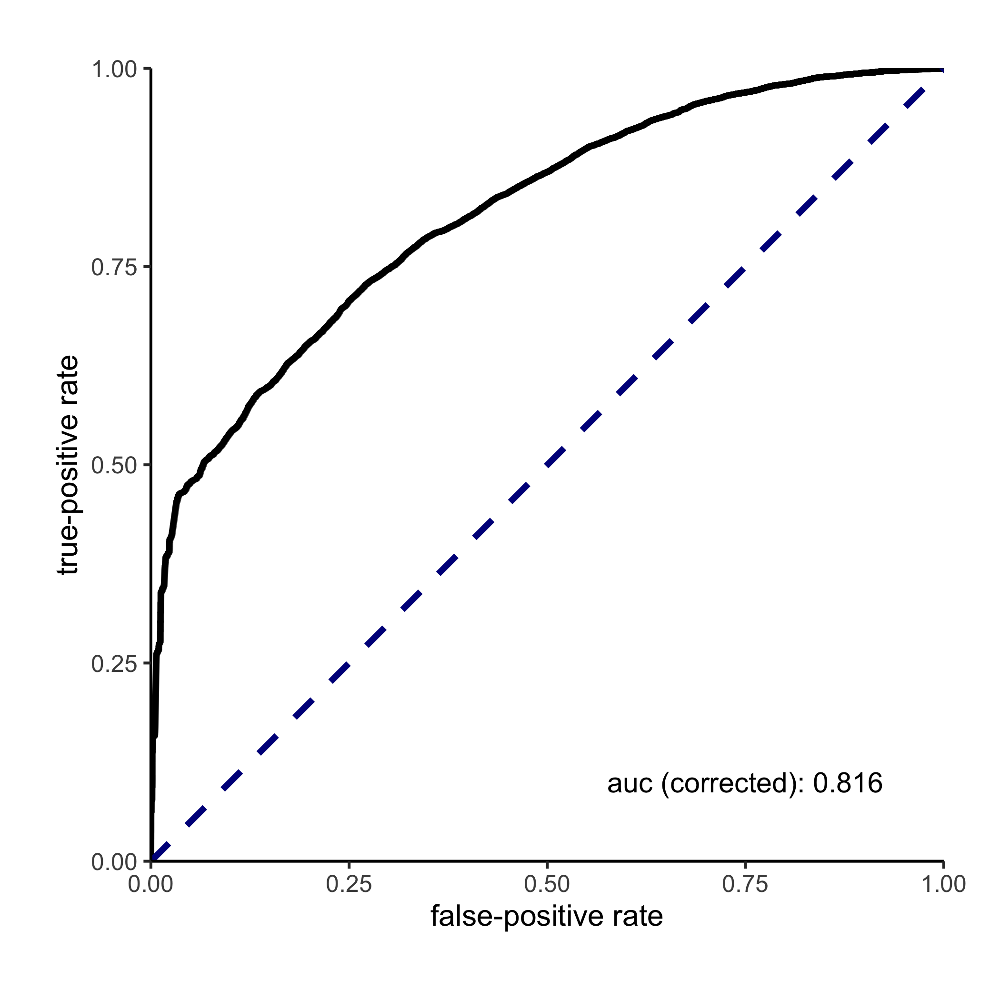

positive-unlabeled learning for dms datasets (pudms)
================

## Description

This package offers a streamlined analysis via PUlasso algorithm for
learning sequence-function relationships using deep mutational scanning
data sets.

## Installation

This step is only needed once on a computer where the `pudms` package has not
been installed before. Start the `R` interpreter and run the lines below to
install from Github using the the **devtools** package:

```r
if(!require(devtools)) install.packages("devtools")
devtools::install_github("RomeroLab/pudms")
quit(save="no")
```

## Input files

Two protein sequence text files, one for the labeled (positive) and the other for the unlabeled (unselected).
    
      - Text files with one sequence per line
      - (Optional) Can be gzip compressed.
      - Example
    
    
    ``` console
    MYYKEIAHALFSDLFALSELYIAVRY*
    MYYKEIAHALFSALFALSPLYIAVRM*
    MYYKELAHALFSAHFALSELYIAVRY*
    MYYKEIAHALFSALFAEHELYIAVRY*
    MRYKEIAHALFSALFALPELYIAVRY*
    ...
    ```


-----

## Example

To setup this example copy all the following files in the [quickexample
directory](./inst/quickexample) to your working directory. 

This [example script](./inst/quickexample/fit_PU_model.R) demonstrates basic
usage of the package using sample labeled and unlabeled sequences.

``` r
# Run this script from the command line 
# R --vanilla --no-save < fit_PU_model.R

# LOAD THE PUDMS LIBRARY
library(pudms)


# SET THE POSITIVE AND UNLABELED SEQUENCE FILES (can be gzipped or not)
pos_file = 'Rocker_sel_sequences_filtered.txt.gz'
unlab_file = 'Rocker_ref_sequences_filtered.txt.gz'


# VARIOUS RUN OPTIONS 
py = NULL         # Proportion of positive sequences in unlabeled set (i.e. fraction functional).
                  # NULL scans a range of possible py values between 1e-3 and 0.5
order = 1         # Model order: 1 for main effects or 2 for pairwise
refstate = NULL   # Reference state for regression.  
                  # NULL chooses the most common residue at each position (preferable for DMS data).  
                  # In contrast, chimera data should use a fixed reference (e.g. 'A')
nobs_thresh = 10  # Filters out columns in X that sum to less than nobs_thresh
n_eff_prop = 1    # Scales the p-values to account for redundant sequence sampling at the NGS step. 
                  # See more in note below.


# OUTPUT FILES
outroc = 'Rocker_CV_ROC.png'
outcsv = 'Rocker_parameters.csv'


# CREATE A PROTEIN DATA SET
pudata = create_protein_dat(path_l = pos_file, path_u = unlab_file) 


# PERFORM CROSS-VALIDATED FITTING OF PU MODEL
cvfit = v.pudms(protein_dat = pudata,
                py1 = py,
		order = order,
		refstate = refstate,
		nobs_thresh = nobs_thresh,
		n_eff_prop = n_eff_prop,
		nhyperparam = 3, # The number of py values to scan. Log spaced between 1e-3 and 0.5
		nfolds = 4,      # The number of cross-validation folds
		nCores = 1,      # The number of cores to use for CV.  
                         # Q: nCores > 1 causes this to crash with the error: 
                         # 2 nodes produced errors; first error: object
                         # 'refstate' not found; Calls: v.pudms ... clusterApply 
                         # -> staticClusterApply -> checkForRemoteErrors
		full.fit = FALSE) # Q: TODO: going to make this default 


# PLOT THE PU-CORRECTED ROC CURVE FOR THE CV FIT
rocplot = with(cvfit, rocplot(roc_curve = roc_curves[[which(py1 == py1.opt)]], py1 = py1.opt))
ggsave(filename = outroc, plot = rocplot)


# REFIT ALL THE DATA WITH THE OPTIMAL PY VALUE AND WRITE MODEL PARAMETERS/PVALUES TO CSV
optpy = cvfit$py1.opt
cat("The optimal py value is", optpy, "\nRefitting model on all the data with this py value\n")
fit = pudms(protein_dat = pudata, 
            py1 = optpy,
	    order = order,
	    refstate = refstate,
	    nobs_thresh = nobs_thresh,
	    n_eff_prop = n_eff_prop,
	    outfile = outcsv) # Q: this does not return group pvalues

```


### Run example
Run the edited script on your data. This will save a csv file with the output in your working directory. 
```shell
R --vanilla --no-save < fit_PU_model.R
```

## Output 

This example's curve looks like 
<p align="center">

</p>

The first few rows of the results look like

|  |coef              |se                |zvalue           |p                   |p.adj               |nobs|eff\_nobs|
|------|------------------|------------------|-----------------|--------------------|--------------------|----|--------|
|Y0.\*  |2.14324437523187  |0.0313069448762633|68.4590714201838 |0                   |0                   |7550|7550    |
|Y0.A  |-0.083107113588467|0.0262392010433295|-3.16728826656079|0.00153867711789975 |0.00172486407508853 |8129|8129    |
|Y0.C  |-1.40721227424033 |0.0902017334163601|-15.6007231894848|7.19741611572199e-55|1.47863234846004e-54|1507|1507    |
|Y0.D  |-2.29631459525582 |0.136816375754836 |-16.7839162716211|3.20017925285385e-63|7.37693902887907e-63|1327|1327    |
|Y0.E  |-1.87447836155712 |0.186862606005878 |-10.0313187406696|1.11023732312351e-23|1.57551018975041e-23|520 |520     |


The entire example results are available [here](./inst/quickexample/Rocker_parameters.csv)
 
