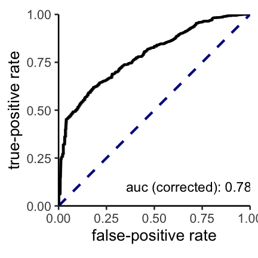

positive-unlabeled learning for dms datasets (pudms)
================

## Description

This package offers a streamlined analysis via PUlasso algorithm for
learning sequence-function relationships using deep mutational scanning
data sets.

## Installation

Install using **devtools** package:

``` r
# install.packages("devtools")
devtools::install_github("RomeroLab/pu-learning")
```

## Input

  - file paths for the two txtfiles containing mutations in labeled
    (post-selected) and unlabeled (pre-selected) sets (path\_l, path\_u)
  - Prevalence of positive examples in the unlabeled set (py1)

-----

## Examples

### Model fitting with a full data set

Here we demonstrate basic usage of the package using sample labeled and
unlabeled sequences (10,000 randomly sampled sequences from casp3
protein data sets)

Input: 

- path\_l, path\_u 
- WT (reference sequence) 
- py1

Here we use the paths where the sample txt files are saved. Please
replace them with the actual file paths (e.g. `"system.file("extdata",
"sample_positive_mutations.txt", package = "pudms",mustWork = T)"` -\>
`"your dir/filename.txt"`).

``` r
library(pudms)

# Inputs

## paths for the example txt files
## replace them with paths for your txt files
path_l = system.file("extdata", "sample_positive_mutations.txt", 
                     package = "pudms",mustWork = T)
path_u = system.file("extdata", "sample_unlabeled_mutations.txt", 
                     package = "pudms",mustWork = T)

## WT (reference) sequence
WT = 'MSGISLDNSYKMDYPEMGLCIIINNKNFHKSTGMTSRSGTDVDAANLRETFRNLKYEVRNKNDLTREEIVELMRDVSKEDHSKRSSFVCVLLSHGEEGIIFGTNGPVDLKKITNFFRGDRCRSLTGKPKLFIIQACRGTELDCGIETDSGVDDDMACHKIPVEADFLYAYSTAPGYYSWRNSKDGSWFIQSLCAMLKQYADKLEFMHILTRVNRKVATEFESFSFDATFHAKKQIPCIVSMLTKELYFYHLEHHHHHH*'

## py1 
protein_py1 = 0.2 # change this to the prevalence of positive examples in your unlabeled set
```

1.  We generate a protein dataset from the specified paths:

<!-- end list -->

``` r
smpl_dat = create_protein_dat(path_l = path_l, path_u = path_u, WT = WT)
#> convert mutations into sequences for a labeled set
#> convert mutations into sequences for an unlabeled set
```

2.  Now, we fit a
model:

<!-- end list -->

``` r
# we filter sequences containing mutations with total number < nobs_thresh
fit1 = pudms(protein_dat = smpl_dat,py1 = protein_py1,nobs_thresh = 10) 
#>  1. create a model matrix X from an aggregated dataset:
#> create a sequence matrix
#> check number of unique factors in each position
#> obtain ``base`` amino-acid states
#> convert to the sparse one-hot-encoding model matrix
#> 2042 unique sequences which contain a feature whose nmuts < 10  are removed
#> check whether a filtered X is a full rank matrix
#> 
#> 
#>  2. fit a model
#> Fitting 0th lambda
#> converged at 432th iterations
#> 
#> 
#>  3. compute p-values
```

3.  Done\!

To view the result in R:

``` r
View(fit1$result_table)
```

To extract the result into the excel file:

``` r
require(xlsx)
write.xlsx(x = fit1$result_table, sheetName = "result", 
           file = "your path/result_table.xlsx")
```

### Model fitting with training and test sets

Here, we will use 90% of the data to train a model and obtain an ROC
curve with remaining 10% of the data.

1.  We split previously generated `smpl_dat` into 90/10 subsamples:

<!-- end list -->

``` r
cv_smpl = cv_grouped_dat(grouped_dat = smpl_dat,
                         test_idx = 1,
                         nfolds = 10,
                         seed = 1) # seed for reproducibility

tr_smpl = cv_smpl$train_grouped_dat # training set
tt_smpl = cv_smpl$test_grouped_dat  # test set
```

2.  We fit a model using a training set `tr_smpl`:

<!-- end list -->

``` r
cv.r = pudms(protein_dat = tr_smpl,py1 = protein_py1,nobs_thresh = 10)
#>  1. create a model matrix X from an aggregated dataset:
#> create a sequence matrix
#> check number of unique factors in each position
#> obtain ``base`` amino-acid states
#> convert to the sparse one-hot-encoding model matrix
#> 2065 unique sequences which contain a feature whose nmuts < 10  are removed
#> check whether a filtered X is a full rank matrix
#> 
#> 
#>  2. fit a model
#> Fitting 0th lambda
#> converged at 412th iterations
#> 
#> 
#>  3. compute p-values
```

3.  We obtain a PU-corrected ROC curve using a test set `tt_smpl`:

<!-- end list -->

``` r
roc = corrected_roc_curve(coef = coef(cv.r), 
                          test_grouped_dat = tt_smpl,
                          py1 = protein_py1)
#> create Xtest for validation examples 
#> create a sequence matrix
#> check number of unique factors in each position
#> obtain ``base`` amino-acid states
#> convert to the sparse one-hot-encoding model matrix
roc$rocplot
```

<!-- -->

To save a
plot:

``` r
ggsave(filename = "roc.png", plot = roc$rocplot, path = "your path to save")
```
